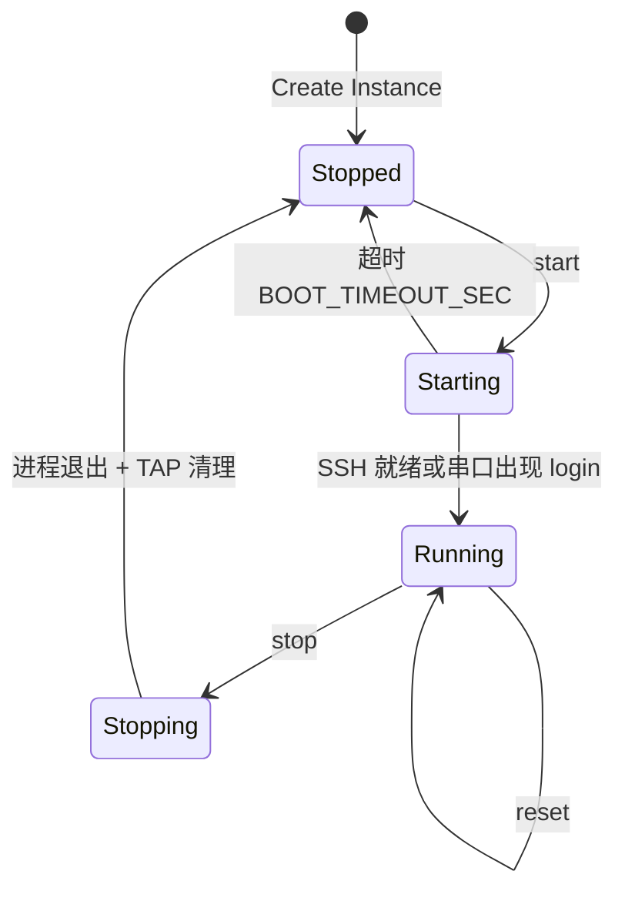

# 固件模拟环境管理系统 (FSEMS) - 项目开发文档

固件模拟环境管理系统 (Firmware Simulation Environment Management System, 简称 **FSEMS**) 是一个基于 Web 的集中式管理平台，旨在解决 IoT 设备（如路由器、摄像头）固件在模拟运行过程中的架构碎片化问题，提供统一的 QEMU 实例生命周期管理、主机与虚拟机间的高效文件交互，以及直观的文件系统双向可视化预览功能。

---

## 1. 项目概述

### 1.1 背景与痛点
在物联网 (IoT) 安全研究和固件分析中，研究人员通常需要在宿主机上模拟运行各种架构的固件。当前主流的做法是使用 QEMU 进行全系统或用户态模拟。然而，这种做法存在以下痛点：
1. **架构碎片化严重**：不同厂商的 IoT 设备采用不同的芯片架构（如 ARM、MIPS、MIPSEL、PPC、x86 等），对应的 QEMU 启动参数复杂且不一致。
2. **缺乏可视化管理**：通常需要通过繁琐的终端命令来管理多个虚拟机实例，难以实时监控运行状态和串口日志。
3. **文件交互困难**：由于固件系统（如 OpenWrt、基于 BusyBox 的定制系统）往往使用老旧的 Dropbear 等轻量级 SSH 服务，传统的 SCP/SFTP 客户端经常因加密算法不匹配或协议不支持而连接失败。
4. **文件树不直观**：无法方便地对比宿主机工作区与访客机（QEMU 虚拟机）内部的文件树结构。

### 1.2 核心目标
FSEMS 旨在通过 Web 界面统一屏蔽底层的复杂性，具体目标如下：
* **统一抽象与封装**：屏蔽底层不同架构（qemu-system-arm, mips, mipsel, x86_64 等）和文件系统（SquashFS, ext4, JFFS2）的差异。
* **可视化生命周期管理**：提供开箱即用的 Web 界面，管理固件模板和虚拟实例的启动、停止、重启与状态监控。
* **高效安全的双向交互**：针对老旧 SSH 服务定制支持 `scp -O` 协议，实现宿主机与 QEMU 实例之间的快速文件互传。
* **双向文件树可视化**：提供类似 WebIDE 的分栏文件管理器，左侧展示宿主机工作目录，右侧展示访客机实时文件系统，并支持懒加载与高性能缓存。

---

## 2. 系统架构设计 (原生运行版)

系统采用前后端分离架构，所有组件在宿主机上**原生运行**（不使用 Docker 容器化），确保各进程能直接访问系统虚拟网络设备和本地文件系统。

```mermaid
graph TD
    subgraph Frontend (Vue 3 + TS)
        UI[Web Dashboard - Element Plus]
        Terminal[Web Terminal - Xterm.js]
        VFS[VFS Viewer - File Tree]
    end

    subgraph Backend (FastAPI)
        API[FastAPI Router]
        WS[WebSocket Manager]
        SSH_Client[Paramiko / AsyncSSH]
        Subproc[Subprocess QEMU Manager]
    end

    subgraph Middleware & Storage
        DB[(SQLite3 - WAL Mode)]
        Cache[(Redis Cache)]
        Broker[(Redis Broker)]
        Celery[Celery Workers]
    end

    subgraph Hypervisor Layer
        QEMU[QEMU Instances]
        TAP[TAP/TUN Bridge]
    end

    %% Flow connections
    UI -->|REST API| API
    Terminal -->|WebSockets| WS
    VFS -->|REST API| API
    
    API -->|Read/Write| DB
    API -->|Read/Write Cache| Cache
    API -->|Enqueue Tasks| Broker
    Broker --> Celery
    
    WS -->|Redirect Serial| QEMU
    Celery -->|SCP guest_ssh_host:22| QEMU
    SSH_Client -->|ls -la / SFTP| QEMU
    Subproc -->|Manage Lifecycle| QEMU
    QEMU <--> TAP
```

### 2.1 模块职责划分

#### 前端 (Frontend)
* **Vue 3 + TypeScript**：提供强类型安全支持，保障代码可维护性。
* **Element Plus**：组件库，用于快速构建精美的后台面板与文件管理界面。
* **Xterm.js**：集成 Web 终端，通过 WebSocket 协议实现与 QEMU 串口输出 (Serial Console) 的实时双向交互。

#### 后端 (Backend)
* **FastAPI**：提供高性能异步支持，通过 Pydantic 进行请求验证，自动生成 OpenAPI 文档。
* **Instance Control Engine**：通过 `subprocess` 异步子进程拉起宿主机本地 QEMU 实例。
* **SSH & File System Engine**：采用 `asyncssh` 和 `paramiko` 实现对访客机的 SSH 控制以及目录结构抓取。

#### 底层执行层 (Hypervisor Layer)
* **QEMU 全系统模拟引擎**：在宿主机上直接执行不同架构的固件。
* **虚拟网络桥接 (Bridge/TAP)**：管理宿主机与多个 QEMU 实例的网络连接与端口转发。

#### 数据库与缓存 (Database & Cache)
* **SQLite3**：轻量级嵌入式数据库，配置为 WAL (Write-Ahead Logging) 模式以提供并发读写能力。连接参数包含 `check_same_thread=False` 以兼容多线程与 Celery Worker 访问。
* **Redis**：作为两用组件：
  1. 缓存文件树的 JSON 结构，避免频繁 SSH 查询。
  2. 作为 Celery 异步任务队列的消息中间件 (Broker)。

### 2.2 部署约束（全宿主机，无 Docker）

| 约束 | 说明 |
| :--- | :--- |
| 不使用 Docker | 全部进程在宿主机原生运行 |
| SQLite3 | 单文件数据库，WAL 模式，见 §9 |
| 本机通信 | Backend / Celery / Redis 使用 `127.0.0.1`；SSH/SCP 使用模板 `guest_ssh_host`（默认 `192.168.1.1`） |
| QEMU 控制 | 仅 `subprocess`，**不使用 libvirt** |
| 网络模型 | **TAP + 网桥**（与用户现有 `start.sh` 一致），MVP 不用 `-netdev user` |

### 2.3 MVP 实现范围

| 阶段 | 包含 | 不包含（后续迭代） |
| :--- | :--- | :--- |
| **Phase 1** | 单用户 JWT；OpenWrt ARMv8 seed 模板；实例 start/stop/reset；TAP 网络；串口 WebSocket；宿主机 VFS；系统前后端日志查看接口与页面 | 快照、模板 CRUD、离线 guestmount、SCP |
| **Phase 2** | Celery SCP 双向传输；访客机在线 VFS；传输进度 | 多实例并行 |
| **Phase 3** | 多架构模板；模板 API；离线 guestmount；快照 | — |

**MVP 多实例限制**：OpenWrt 默认 LAN 为 `192.168.1.1/24`，同网桥多实例会 IP 冲突。Phase 1 **同一时间仅允许 1 个 RUNNING 实例**；启动新实例前须停止已有实例。

---

## 3. 项目目录结构设计

### 3.0 仓库根目录

```text
FSEMS/
├── AGENTS.md
├── README.md
├── backend/
├── frontend/
├── scripts/
│   ├── install_host_deps.sh
│   ├── setup_network.sh        # 全局网桥 + NAT（参考用户 start.sh 网络段）
│   └── dev_start.sh
├── .env.example
├── .gitignore
├── data/                       # 开发环境 SQLite（gitignore）
└── docs/
    └── FSEMS_development_document.md
```

### 3.1 后端项目结构 (`backend/`)
```text
backend/
├── app/
│   ├── __init__.py
│   ├── main.py                 # FastAPI 入口
│   ├── core/                   # 核心配置与工具
│   │   ├── config.py           # 环境变量与系统配置
│   │   ├── security.py         # JWT 加密与鉴权
│   │   ├── database.py         # SQLite 连接初始化与 WAL 配置
│   │   └── celery_app.py       # Celery 实例与配置
│   ├── api/                    # 路由层
│   │   ├── v1/
│   │   │   ├── auth.py         # 认证接口
│   │   │   ├── templates.py    # 模板管理
│   │   │   ├── instances.py    # 实例管理 (包含 WebSocket 串口)
│   │   │   ├── fs.py           # VFS 预览与操作
│   │   │   ├── tasks.py        # 任务进度查询
│   │   │   └── logs.py         # 日志接口 (前后端系统日志)
│   ├── models/                 # SQLAlchemy 数据库模型 (兼容 SQLite3)
│   │   ├── template.py
│   │   ├── instance.py
│   │   └── task.py
│   ├── schemas/                # Pydantic 响应与输入校验
│   │   ├── auth.py
│   │   ├── template.py
│   │   ├── instance.py
│   │   └── fs.py
│   ├── services/               # 核心业务逻辑层
│   │   ├── qemu_manager.py     # subprocess 生命周期 + TAP 管理
│   │   ├── ssh_service.py      # SSH 会话与目录解析
│   │   └── network_setup.py    # TAP 创建/销毁、网桥加入
│   └── tasks/                  # Celery 异步任务
│       └── file_transfer.py    # 异步 SCP 传输任务
├── requirements.txt
└── alembic.ini                 # 数据库迁移配置 (可选)
```

### 3.2 前端项目结构 (`frontend/`)
```text
frontend/
├── src/
│   ├── assets/                 # 静态资源 (图片、基础样式)
│   ├── components/             # 公用 UI 组件
│   │   ├── TerminalConsole.vue # Xterm.js 串口终端组件
│   │   └── FileTree.vue        # 懒加载文件树组件
│   ├── router/                 # Vue Router 路由配置
│   │   └── index.ts
│   ├── stores/                 # Pinia 状态管理 (Auth, Instances)
│   │   ├── auth.ts
│   │   └── instance.ts
│   ├── views/                  # 视图页面
│   │   ├── Login.vue           # 登录页
│   │   ├── Dashboard.vue       # 仪表盘主页
│   │   ├── InstanceList.vue    # 实例管理面板
│   │   ├── FileManager.vue     # 主客双栏文件管理器
│   │   └── LogViewer.vue       # 系统前后端日志查看页面
│   ├── api/                    # Axios 请求封装
│   │   ├── request.ts
│   │   └── endpoints.ts
│   ├── App.vue
│   └── main.ts
├── tsconfig.json
├── vite.config.ts
└── package.json
```

---

## 4. 宿主机环境与网络配置准备

FSEMS 与用户现有 OpenWrt 启动方式（`/home/kali/openwrt/armv8/start.sh`）保持一致：**TAP 设备 + Linux 网桥**，宿主机与访客机处于同一二层网段。

### 4.1 网络拓扑（与用户 start.sh 对应关系）

| 用户 start.sh | FSEMS 等价物 | 说明 |
| :--- | :--- | :--- |
| `br0` + `192.168.1.10/24` | `br_fsems` + `192.168.1.10/24` | 全局网桥，由 `setup_network.sh` 创建 |
| `tap0` | `tap_{instance_id前8位}` | 每实例独立 TAP，由 `qemu_manager` 创建 |
| 访客机 OpenWrt LAN | `192.168.1.1`（模板 `guest_ssh_host`） | SSH/SCP/VFS 直连此 IP |
| `-nographic` + 串口 | `-serial unix:...sock` + `-display none` | Web 控制台需 Unix Socket |

```text
                    ┌─────────────────────────────────┐
  宿主机 br_fsems   │  192.168.1.10/24 (setup_network) │
       │            └──────────┬──────────────────────┘
       │                       │
  tap_abc12345 ─────────────────┤
       │                       │
  QEMU (OpenWrt)                │
  LAN: 192.168.1.1              │
       └───────────────────────┘
```

### 4.2 服务与通信矩阵

| 组件 | 地址 | 访问方 |
| :--- | :--- | :--- |
| SQLite | `/var/fsems/data/fsems.db` | FastAPI、Celery |
| Redis | `127.0.0.1:6379` | FastAPI、Celery |
| FastAPI | `127.0.0.1:8000` | 前端 |
| Vite (dev) | `127.0.0.1:5173` | 浏览器 |
| 访客机 SSH | `192.168.1.1:22`（模板可配） | Backend、Celery |
| QEMU 串口 | `{QEMU_SERIAL_DIR}/qemu_serial_{id}.sock` | FastAPI WebSocket |

### 4.3 依赖安装

```bash
sudo ./scripts/install_host_deps.sh
# 或手动：
sudo apt update && sudo apt install -y \
  qemu-system-arm qemu-system-mips qemu-system-x86 qemu-utils \
  bridge-utils uml-utilities libguestfs-tools iptables \
  redis-server python3 python3-venv python3-pip nodejs npm
sudo systemctl enable --now redis-server
```

### 4.4 数据目录与环境变量

```bash
sudo mkdir -p /var/fsems/{data,workspace,images,kernels,mnt}
sudo chown -R "$USER:$USER" /var/fsems
cp .env.example .env
```

`.env` 关键项见 [`.env.example`](../.env.example)：

| 变量 | 用途 |
| :--- | :--- |
| `FSEMS_USER` | 创建 TAP 时的 `user`（默认当前用户） |
| `FSEMS_GUEST_SSH_PASSWORD` | OpenWrt root SSH/SCP 密码 |
| `FSEMS_ADMIN_USER` / `FSEMS_ADMIN_PASSWORD` | Web 登录 |
| `BOOT_TIMEOUT_SEC` | 启动探活超时（默认 120） |

固件文件建议放置：

```text
/var/fsems/kernels/openwrt-25.12.4-armsr-armv8-generic-kernel.bin
/var/fsems/images/openwrt-25.12.4-armsr-armv8-generic-ext4-rootfs.img
```

（文件名与用户 `start.sh` 中一致，可从 `/home/kali/openwrt/armv8/` 复制。）

### 4.5 网桥初始化

```bash
sudo ./scripts/setup_network.sh
```

默认创建 `br_fsems`，地址 `192.168.1.10/24`，并配置 NAT（可选访问外网）。环境变量可覆盖：`FSEMS_BRIDGE`、`FSEMS_BRIDGE_CIDR`、`FSEMS_PHY_NIC`。

### 4.6 开发启动顺序

```bash
# 1. Redis + 网桥
sudo systemctl start redis-server
sudo ./scripts/setup_network.sh

# 2. 后端
cd backend && python3 -m venv .venv && source .venv/bin/activate
pip install -r requirements.txt
# 首次：初始化 DB（create_all 或 alembic upgrade head）
uvicorn app.main:app --host 127.0.0.1 --port 8000 --reload

# 3. Celery（新终端，同一用户、同一 .env）
celery -A app.core.celery_app worker --loglevel=info

# 4. 前端
cd frontend && npm install && npm run dev
```

或使用 `./scripts/dev_start.sh` 一键启动 API + Celery + 前端。

> **权限说明**：创建 TAP / 加入网桥需要 `CAP_NET_ADMIN`。开发阶段可 sudo 运行 Backend，或通过 `sudo setcap cap_net_admin+ep $(which python3)` 赋权（生产慎用）。

---

## 5. 核心功能模块设计

### 5.1 实例管理与调度模块 (Instance Manager)

#### 固件配置模板字段

| 字段 | 说明 | OpenWrt ARMv8 示例 |
| :--- | :--- | :--- |
| `qemu_binary` | QEMU 可执行文件 | `qemu-system-aarch64` |
| `machine` | `-M` 机器类型 | `virt` |
| `cpu` | `-cpu` 型号 | `cortex-a72` |
| `arch` | 架构标识（展示用） | `aarch64` |
| `kernel_path` | 内核镜像绝对路径 | `/var/fsems/kernels/openwrt-...-kernel.bin` |
| `drive_path` | rootfs 磁盘镜像 | `/var/fsems/images/openwrt-...-rootfs.img` |
| `kernel_append` | `-append` 内核参数 | `root=/dev/vda rootfstype=ext4 console=ttyAMA0` |
| `ram_size` | 内存 MB | `512` |
| `guest_ssh_host` | 访客机 SSH 地址 | `192.168.1.1` |
| `guest_ssh_port` | SSH 端口 | `22` |
| `extra_args` | 附加 QEMU 参数 | 空或 `-no-reboot` |

#### 生命周期状态机



**启动成功判定（`Starting → Running`）**：满足以下任一条件：
1. 对 `guest_ssh_host:guest_ssh_port` TCP 连接成功（推荐，超时 `BOOT_TIMEOUT_SEC`，默认 120s）
2. 串口 Socket 出现 OpenWrt 启动完成关键字（如 `br-lan` / `login:`）

**Phase 1 约束**：若已有其他实例为 `RUNNING`，拒绝新的 `start` 动作，返回 `INSTANCE_STATE_CONFLICT`。

#### 停止与清理

1. 向 QEMU 子进程发送 SIGTERM，10s 后 SIGKILL
2. 删除 TAP 设备：`ip link delete tap_{short_id}`
3. 删除串口 Socket 文件
4. 更新 SQLite 状态为 `STOPPED`，清空 `pid`

---

### 5.2 QEMU 启动规格（基于用户 start.sh）

参考脚本：`/home/kali/openwrt/armv8/start.sh`

#### 5.2.1 用户原始命令（手动启动）

```bash
qemu-system-aarch64 \
  -M virt \
  -cpu cortex-a72 \
  -m 512M \
  -nographic \
  -kernel openwrt-25.12.4-armsr-armv8-generic-kernel.bin \
  -append "root=/dev/vda rootfstype=ext4 console=ttyAMA0" \
  -drive if=none,file=openwrt-25.12.4-armsr-armv8-generic-ext4-rootfs.img,format=raw,id=hd \
  -device virtio-blk-device,drive=hd \
  -netdev tap,id=net0,ifname=tap0,script=no,downscript=no \
  -device virtio-net-pci,netdev=net0
```

#### 5.2.2 FSEMS 托管命令（`qemu_manager.build_cmd()`）

相对用户脚本的变更：
- `-nographic` → `-display none` + `-serial unix:...,server,nowait`（供 WebSocket 使用）
- `tap0` → 每实例独立 `tap_{short_id}`
- 路径改为 `/var/fsems/` 下绝对路径
- 可选 `-pidfile` 便于进程跟踪

```bash
# 1) 网络准备（qemu_manager.setup_tap）
ip tuntap add dev tap_abc12345 mode tap user "${FSEMS_USER}"
ip link set tap_abc12345 up
brctl addif br_fsems tap_abc12345

# 2) 启动 QEMU
qemu-system-aarch64 \
  -M virt \
  -cpu cortex-a72 \
  -m 512M \
  -display none \
  -kernel /var/fsems/kernels/openwrt-25.12.4-armsr-armv8-generic-kernel.bin \
  -append "root=/dev/vda rootfstype=ext4 console=ttyAMA0" \
  -drive if=none,file=/var/fsems/images/openwrt-25.12.4-armsr-armv8-generic-ext4-rootfs.img,format=raw,id=hd \
  -device virtio-blk-device,drive=hd \
  -netdev tap,id=net0,ifname=tap_abc12345,script=no,downscript=no \
  -device virtio-net-pci,netdev=net0 \
  -serial unix:/tmp/qemu_serial_inst_9b1deb4d.sock,server,nowait
```

#### 5.2.3 `qemu_manager.py` 职责

| 方法 | 功能 |
| :--- | :--- |
| `build_cmd(instance, template) -> list[str]` | 拼装 argv |
| `setup_tap(instance) -> None` | 创建 TAP 并加入 `br_fsems` |
| `teardown_tap(instance) -> None` | 停止后删除 TAP |
| `start(instance) -> int` | subprocess.Popen，记录 pid |
| `stop(instance) -> None` | 终止进程并清理 |
| `wait_boot(instance) -> bool` | SSH 探活直至 Running 或超时 |

---

### 5.3 网络模块（TAP + 网桥）

不再使用 `-netdev user` 的 `hostfwd` 端口映射。SSH/SCP 直连访客机 LAN IP。

| 步骤 | 执行者 | 命令/逻辑 |
| :--- | :--- | :--- |
| 创建全局网桥 | `setup_network.sh`（一次性） | `br_fsems` @ `192.168.1.10/24` |
| 创建实例 TAP | `qemu_manager` | `tap_{id[:8]}` |
| 加入网桥 | `qemu_manager` | `brctl addif br_fsems tap_*` |
| SSH 连通性 | Backend / Celery | `asyncssh.connect("192.168.1.1", 22, ...)` |

**并发控制（Phase 1）**：通过业务逻辑限制仅 1 个 RUNNING 实例，避免多 OpenWrt 同网段 IP 冲突。Phase 3 可为每实例分配独立网桥 / 网段。

---

### 5.4 串口 WebSocket 协议

**端点**：`WS /api/v1/instances/{id}/console?token={JWT}`

| 项目 | 规格 |
| :--- | :--- |
| 鉴权 | Query `token` 校验 JWT；无效则关闭连接（code 4401） |
| 客户端 → 服务端 | **Binary 帧**，原始字节 = 键盘输入至 QEMU 串口 |
| 服务端 → 客户端 | **Binary 帧**，QEMU 串口输出 |
| 心跳 | 客户端每 30s 发送 Text `"ping"`，服务端回复 `"pong"` |
| 断线 | QEMU 停止时服务端主动 Close（code 1000） |
| 终端尺寸 | 可选 Text JSON：`{"type":"resize","cols":120,"rows":40}`（Phase 2） |

Backend 使用 `asyncio` 打开 Unix Socket，与 WebSocket 双向 `asyncio.StreamReader/Writer` 转发。

---

### 5.5 宿主机-访客机文件互传模块 (File Transfer)

#### SCP 命令（TAP 网络，直连访客机 IP）

```bash
scp -O -P 22 \
  -o KexAlgorithms=+diffie-hellman-group1-sha1,diffie-hellman-group14-sha1 \
  -o HostKeyAlgorithms=+ssh-rsa,ssh-dss \
  -o PubkeyAcceptedKeyTypes=+ssh-rsa \
  -o CipherAlgorithms=+3des-cbc,aes128-cbc \
  -o StrictHostKeyChecking=no \
  -o UserKnownHostsFile=/dev/null \
  /var/fsems/workspace/exploit.py root@192.168.1.1:/tmp/exploit.py
```

密码通过环境变量 `FSEMS_GUEST_SSH_PASSWORD` 注入；若为空则尝试无密码或密钥（Phase 1 推荐在 `.env` 配置）。

#### 传输进度

Phase 2 采用简化进度：`0`（PENDING）→ `50`（RUNNING）→ `100`（SUCCESS/ FAILURE），不做字节级精确统计。

#### 异步流程

（序列图同前，SCP 目标改为 `guest_ssh_host`。）

---

### 5.6 虚拟文件系统预览模块 (VFS Viewer)

#### 主机侧

- 根路径限制在 `FSEMS_WORKSPACE`（默认 `/var/fsems/workspace`）
- 路径规范化：`Path.resolve()` 后必须以 workspace 为前缀，否则 `FS_PATH_NOT_FOUND`
- 拒绝 `..` 穿越

#### 访客侧（在线）

- SSH 至 `guest_ssh_host`，执行 `find {path} -maxdepth 1 -exec ls -lad {} +`
- Redis 缓存 TTL 10s，键 `fsems:fs_cache:{id}:{path_hash}`

#### 访客侧（离线，Phase 3）

- `guestmount -a {drive_path} -m /dev/sda --ro /mnt/fsems_offline/{id}`

---

## 6. 详细 API 接口设计 (v1)

### 6.1 统一响应格式与 HTTP 状态码

**信封格式**（除 WebSocket 外）：

```json
{
  "success": true,
  "data": {},
  "error_code": "",
  "message": ""
}
```

| 场景 | HTTP 状态码 |
| :--- | :--- |
| 成功 | 200 / 201 / 202 |
| 参数错误 | 400 + `error_code` |
| 未认证 | 401 |
| 业务冲突 | 409 + `error_code` |
| 资源不存在 | 404 + `error_code` |

---

### 6.2 用户认证 API

**Phase 1 方案：单用户，凭据来自 `.env`**

| 环境变量 | 说明 | 默认值 |
| :--- | :--- | :--- |
| `FSEMS_ADMIN_USER` | 登录用户名 | `admin` |
| `FSEMS_ADMIN_PASSWORD` | 登录密码 | `admin`（生产必须修改） |
| `SECRET_KEY` | JWT 签名密钥 | — |
| `JWT_EXPIRE_SECONDS` | Token 有效期 | `3600` |

密码校验使用 `passlib[bcrypt]` 或 Phase 1 简化明文比对（仅开发）。**不建 users 表**。

#### `POST /api/v1/auth/login`
* **功能**：用户登录，获取 JWT Token。
* **请求体**：
```json
{
  "username": "admin",
  "password": "secure_password"
}
```
* **成功响应 (200 OK)**：
```json
{
  "success": true,
  "data": {
    "access_token": "eyJhbGciOiJIUzI1NiIsIn...",
    "token_type": "bearer",
    "expires_in": 3600
  },
  "error_code": "",
  "message": "Login success"
}
```

---

### 6.3 固件模板管理 API

#### `GET /api/v1/templates`
* **功能**：获取所有固件配置模板。
* **响应示例 (200 OK)**：
```json
{
  "success": true,
  "data": [
    {
      "id": 1,
      "name": "OpenWrt 25.12 ARMv8 (virt)",
      "arch": "aarch64",
      "qemu_binary": "qemu-system-aarch64",
      "machine": "virt",
      "cpu": "cortex-a72",
      "kernel_path": "/var/fsems/kernels/openwrt-25.12.4-armsr-armv8-generic-kernel.bin",
      "drive_path": "/var/fsems/images/openwrt-25.12.4-armsr-armv8-generic-ext4-rootfs.img",
      "kernel_append": "root=/dev/vda rootfstype=ext4 console=ttyAMA0",
      "ram_size": 512,
      "guest_ssh_host": "192.168.1.1",
      "guest_ssh_port": 22,
      "extra_args": ""
    }
  ],
  "error_code": "",
  "message": "Templates fetched"
}
```

---

### 6.4 实例生命周期 API

#### `GET /api/v1/instances`
* **功能**：分页获取所有虚拟机实例及当前运行状态。
* **参数**：`page` (int), `limit` (int)
* **响应示例 (200 OK)**：
```json
{
  "success": true,
  "data": {
    "total": 12,
    "list": [
      {
        "id": "inst_9b1deb4d-3b7d-4bad-9bdd-2b0d7b3dcb6d",
        "name": "Target-Router-01",
        "template_id": 1,
        "status": "RUNNING",
        "tap_name": "tap_9b1deb4d",
        "guest_ssh_host": "192.168.1.1",
        "guest_ssh_port": 22,
        "pid": 12345,
        "created_at": "2026-06-28T12:00:00Z"
      }
    ]
  },
  "error_code": "",
  "message": "Instances fetched"
}
```

#### `POST /api/v1/instances`
* **功能**：上传固件映像（可选）并创建一个新实例。
* **请求体 (multipart/form-data)**：
  * `name`: "Target-Router-01"
  * `template_id`: 1
  * `firmware_file`: [File Binary] (可选，若不提供则使用模板默认映像)
* **响应示例 (201 Created)**：
```json
{
  "success": true,
  "data": {
    "id": "inst_9b1deb4d-3b7d-4bad-9bdd-2b0d7b3dcb6d",
    "status": "STOPPED"
  },
  "error_code": "",
  "message": "Instance created successfully"
}
```

* **固件上传存储**：若提供 `firmware_file`，保存至 `/var/fsems/images/instances/{instance_id}.img`，并写入实例 `drive_path` 字段覆盖模板默认值。

#### `POST /api/v1/instances/{id}/action`
* **功能**：控制实例的生命周期。
* **请求体**：
```json
{
  "action": "start" // 可选值: "start", "stop", "reset"
}
```
* **响应示例 (200 OK)**：
```json
{
  "success": true,
  "data": {
    "id": "inst_9b1deb4d-3b7d-4bad-9bdd-2b0d7b3dcb6d",
    "status": "STARTING"
  },
  "error_code": "",
  "message": "Action 'start' initiated"
}
```

#### `POST /api/v1/instances/{id}/snapshots` — **Phase 3，MVP 不实现**

> 预留接口。实现方案待定（qcow2 快照或镜像 copy-on-write）。

#### `WS /api/v1/instances/{id}/console`
* **功能**：双向 WebSocket，QEMU 串口数据（见 §5.4）。
* **安全性**：连接建立时需携带 `?token=JWT_TOKEN` 进行身份验证。

---

### 6.5 文件系统与传输 API

#### `GET /api/v1/fs/host`
* **功能**：浏览宿主机指定目录的文件列表（支持懒加载，只返回当前层级）。
* **参数**：`path` (string，相对 workspace 的路径，默认 `""` 表示根)
* **安全**：禁止访问 `FSEMS_WORKSPACE` 以外的路径
* **响应示例 (200 OK)**：
```json
{
  "success": true,
  "data": {
    "current_path": "/var/fsems/workspace",
    "files": [
      {
        "name": "firmware_root",
        "path": "/var/fsems/workspace/firmware_root",
        "is_dir": true,
        "size": 4096,
        "mtime": 1782635900
      },
      {
        "name": "exploit.py",
        "path": "/var/fsems/workspace/exploit.py",
        "is_dir": false,
        "size": 1024,
        "mtime": 1782635999
      }
    ]
  },
  "error_code": "",
  "message": "Host directory listed"
}
```

#### `GET /api/v1/fs/guest/{id}`
* **功能**：通过 SSH 登录到指定的 QEMU 实例，或通过离线挂载读取指定目录的文件树。
* **参数**：
  * `path` (string, 默认 `/`)
  * `mode` (string, 默认 `online`；`offline` 为 Phase 3)
* **响应示例 (200 OK)**：
```json
{
  "success": true,
  "data": {
    "instance_id": "inst_9b1deb4d-3b7d-4bad-9bdd-2b0d7b3dcb6d",
    "current_path": "/etc",
    "files": [
      {
        "name": "config",
        "path": "/etc/config",
        "is_dir": true,
        "size": 4096,
        "mtime": 1672531199
      },
      {
        "name": "passwd",
        "path": "/etc/passwd",
        "is_dir": false,
        "size": 128,
        "mtime": 1672531200
      }
    ]
  },
  "error_code": "",
  "message": "Guest directory listed"
}
```

#### `POST /api/v1/fs/transfer`
* **功能**：发起文件传输任务（宿主机与访客机双向）。
* **请求体**：
```json
{
  "instance_id": "inst_9b1deb4d-3b7d-4bad-9bdd-2b0d7b3dcb6d",
  "direction": "host_to_guest", // 可选值: "host_to_guest", "guest_to_host"
  "src": "/var/fsems/workspace/exploit.py",
  "dest": "/tmp/exploit.py"
}
```
* **响应示例 (202 Accepted)**：
```json
{
  "success": true,
  "data": {
    "task_id": "task_2a98f12c-90df-4f40-b3b3-0599a8bc4a54"
  },
  "error_code": "",
  "message": "Transfer task queued"
}
```

#### `GET /api/v1/tasks/{task_id}/status`
* **功能**：查询 Celery 异步传输任务的状态与执行进度。
* **响应示例 (200 OK)**：
```json
{
  "success": true,
  "data": {
    "task_id": "task_2a98f12c-90df-4f40-b3b3-0599a8bc4a54",
    "status": "RUNNING", // 可选值: "PENDING", "RUNNING", "SUCCESS", "FAILURE"
    "progress": 45, // 传输百分比
    "error_msg": null
  },
  "error_code": "",
  "message": "Task status queried"
}
```

### 6.6 系统日志 API

前端上报的日志默认追加写入宿主机 `/var/fsems/logs/frontend_client.log` 文件中，并通过接口进行逆序行级读取，无需占用 SQLite3 核心数据库，保证日志的高吞吐和轻量化设计。

#### `GET /api/v1/logs/backend`
* **功能**：获取后端的系统日志（FastAPI 与 Celery 运行日志）。
* **参数**：
  * `type` (string, 默认 `fastapi`；可选值: `fastapi`, `celery`)
  * `lines` (int, 默认 `100`, 最大 `1000`)
  * `offset` (int, 默认 `0`)
* **响应示例 (200 OK)**：
```json
{
  "success": true,
  "data": {
    "log_type": "fastapi",
    "total_lines": 1420,
    "lines": [
      "[2026-06-28 14:00:00] INFO: Uvicorn running on http://127.0.0.1:8000",
      "[2026-06-28 14:00:05] INFO: Opened SQLite DB at /var/fsems/data/fsems.db"
    ]
  },
  "error_code": "",
  "message": "Backend logs fetched"
}
```

#### `POST /api/v1/logs/frontend`
* **功能**：前端向后端上报客户端错误日志。
* **请求体**：
```json
{
  "level": "ERROR", // 可选值: "INFO", "WARN", "ERROR"
  "message": "Uncaught TypeError: Cannot read properties of undefined",
  "stack": "TypeError: Cannot read properties of undefined\n  at click (App.vue:10:15)",
  "url": "http://127.0.0.1:5173/instances"
}
```
* **响应示例 (200 OK)**：
```json
{
  "success": true,
  "data": null,
  "error_code": "",
  "message": "Client log reported"
}
```

#### `GET /api/v1/logs/frontend`
* **功能**：查询前端上报的日志。
* **参数**：
  * `limit` (int, 默认 `50`)
  * `offset` (int, 默认 `0`)
* **响应示例 (200 OK)**：
```json
{
  "success": true,
  "data": {
    "logs": [
      {
        "id": 1,
        "level": "ERROR",
        "message": "Uncaught TypeError: Cannot read properties of undefined",
        "stack": "TypeError: Cannot read properties of undefined\n  at click (App.vue:10:15)",
        "url": "http://127.0.0.1:5173/instances",
        "created_at": "2026-06-28T14:05:00Z"
      }
    ]
  },
  "error_code": "",
  "message": "Frontend logs fetched"
}
```

---

## 7. 错误码与异常处理规范

业务错误通过 **HTTP 4xx/409** 与响应体 `error_code` 共同表达（见 §6.1）。成功时 `success: true` 且 `error_code` 为空字符串。

| 错误码 (error_code) | 业务场景说明 | 建议处理方式 |
| :--- | :--- | :--- |
| `AUTH_INVALID_CREDENTIALS` | 账号或密码错误 | 提示用户检查账号密码并重新输入 |
| `AUTH_TOKEN_EXPIRED` | JWT 令牌过期 | 前端捕获后清除本地 token 并跳转登录页 |
| `INSTANCE_NOT_FOUND` | 查询或控制不存在的虚拟机实例 | 提示实例已失效并刷新列表 |
| `INSTANCE_STATE_CONFLICT` | 重复 start、未运行时 stop、或 Phase 1 已有 RUNNING 实例 | 提示并刷新列表 |
| `INSTANCE_BOOT_TIMEOUT` | Starting 超时未 SSH 就绪 | 自动回滚 Stopped，展示串口日志 |
| `TAP_SETUP_FAILED` | TAP/网桥配置失败 | 检查 root 权限与 br_fsems |
| `SSH_CONNECT_FAILED` | 在线模式下无法通过 SSH 连通虚拟机 | 提示检查虚拟机网络与 SSH 服务状态，并转为离线模式 |
| `FS_PATH_NOT_FOUND` | 指定的工作路径或虚拟机路径不存在 | 弹窗警告，阻断深入访问并回退至根目录 |
| `TRANSFER_EXECUTION_ERROR` | SCP 传输底层执行失败 | 任务状态表记录失败原因，前端展示具体红叉提示 |
| `LOG_FILE_READ_FAILED` | 读取宿主机日志文件失败 | 确认日志目录读写权限与文件是否存在 |

---

## 8. 核心难点与详细解决方案

### 8.1 OpenWrt/IoT 的遗留加密算法支持
在 Python 后端使用 `Paramiko` 或 `AsyncSSH` 时，需要在连接配置中显式注册这些旧版算法。例如 `AsyncSSH`：
```python
import asyncssh

async def connect_legacy_ssh(host, port, username, password):
    # 手动降级指定客户端可接受的安全策略
    return await asyncssh.connect(
        host, port=port,
        username=username, password=password,
        kex_algs=['diffie-hellman-group1-sha1', 'diffie-hellman-group14-sha1'],
        host_key_algs=['ssh-rsa', 'ssh-dss'],
        encryption_algs=['3des-cbc', 'aes128-cbc'],
        known_hosts=None
    )
```

### 8.2 访客侧文件树抓取的性能瓶颈与缓存机制
1. **前端懒加载 (Lazy Loading)**：前端文件树组件（ElTree）只获取当前展开层级的数据，而不是一次性拉取整棵树。
2. **短时间 Redis 缓存**：后端接收到 `/api/v1/fs/guest/{id}?path=/etc` 请求后：
   * 以 `fsems:fs_cache:{id}:{path_hash}` 为键，去 Redis 中查询缓存。
   * 若命中缓存，则直接返回 JSON。
   * 若未命中，则发起 SSH 连接执行命令解析，将 JSON 写入 Redis，并设置过期时间 **TTL 为 10 秒**。这既保证了操作的即时反馈，又避免了短时间内的重复 SSH 握手开销。
3. **主动失效**：当用户通过系统进行文件传输（向虚拟机写入文件）后，主动清除受影响目录的缓存。

### 8.3 SQLite3 并发与多进程访问

* **WAL 模式**：`PRAGMA journal_mode=WAL`
* **连接超时**：`connect_args={"timeout": 30}`，`check_same_thread=False`
* **写事务**：状态变更使用 `BEGIN IMMEDIATE`
* **Celery 与 FastAPI** 共用同一 `DATABASE_URL` 文件路径

---

## 9. 数据库表设计 (SQLAlchemy + SQLite3)

连接串：`sqlite+aiosqlite:////var/fsems/data/fsems.db`（见 `.env.example`）

### 9.0 初始化

```python
engine = create_async_engine(
    settings.DATABASE_URL,
    connect_args={"check_same_thread": False, "timeout": 30},
)
# 启动时: PRAGMA journal_mode=WAL; Base.metadata.create_all
```

首次启动写入 **seed 模板**（OpenWrt ARMv8，字段见 §5.1 示例）。

### 9.1 固件配置模板表 (`templates`)

```python
class Template(Base):
    __tablename__ = "templates"

    id = Column(Integer, primary_key=True, autoincrement=True)
    name = Column(String(100), nullable=False)
    arch = Column(String(20), nullable=False)
    qemu_binary = Column(String(50), nullable=False)   # qemu-system-aarch64
    machine = Column(String(50), nullable=False)         # virt
    cpu = Column(String(50), nullable=False)           # cortex-a72
    kernel_path = Column(String(512), nullable=False)
    drive_path = Column(String(512), nullable=False)
    kernel_append = Column(Text, nullable=False)
    ram_size = Column(Integer, default=512)
    guest_ssh_host = Column(String(45), default="192.168.1.1")
    guest_ssh_port = Column(Integer, default=22)
    extra_args = Column(Text, nullable=True)
```

### 9.2 QEMU 实例表 (`instances`)

```python
class Instance(Base):
    __tablename__ = "instances"

    id = Column(String(50), primary_key=True)            # inst_{uuid}
    name = Column(String(100), nullable=False)
    template_id = Column(Integer, ForeignKey("templates.id"), nullable=False)
    status = Column(String(20), default="STOPPED")
    drive_path = Column(String(512), nullable=True)      # 覆盖模板镜像
    tap_name = Column(String(32), nullable=True)       # tap_9b1deb4d
    guest_ssh_host = Column(String(45), nullable=True)   # 冗余存储，便于覆盖
    pid = Column(Integer, nullable=True)
    serial_socket = Column(String(255), nullable=True)
    error_msg = Column(Text, nullable=True)
    created_at = Column(DateTime, default=datetime.utcnow)
    updated_at = Column(DateTime, onupdate=datetime.utcnow)
```

### 9.3 异步任务记录表 (`tasks`)

```python
class Task(Base):
    __tablename__ = "tasks"

    id = Column(String(50), primary_key=True)
    instance_id = Column(String(50), nullable=False)
    task_type = Column(String(30), nullable=False)       # FILE_TRANSFER
    status = Column(String(20), default="PENDING")
    progress = Column(Integer, default=0)
    error_msg = Column(Text, nullable=True)
    created_at = Column(DateTime, default=datetime.utcnow)
    updated_at = Column(DateTime, onupdate=datetime.utcnow)
```

---

## 10. 前端路由与联调

### 10.1 路由表

| 路径 | 组件 | 说明 |
| :--- | :--- | :--- |
| `/login` | `Login.vue` | 登录 |
| `/` | `Dashboard.vue` | 重定向至 `/instances` |
| `/instances` | `InstanceList.vue` | 实例列表 |
| `/instances/:id/console` | `TerminalConsole.vue` | 串口终端 |
| `/instances/:id/files` | `FileManager.vue` | 双栏文件管理 |

### 10.2 Vite 开发代理 (`vite.config.ts`)

```typescript
server: {
  proxy: {
    "/api": { target: "http://127.0.0.1:8000", changeOrigin: true },
    "/ws": { target: "ws://127.0.0.1:8000", ws: true },
  },
}
```

WebSocket 实际连接：`ws://127.0.0.1:5173/api/v1/instances/{id}/console?token=...`（经代理转发）。

### 10.3 CORS

FastAPI 开发模式允许 Origin `http://127.0.0.1:5173`。

---

## 11. Python / Node 依赖清单

### 11.1 `backend/requirements.txt`（拟定版本）

```text
fastapi>=0.110.0
uvicorn[standard]>=0.27.0
pydantic-settings>=2.0.0
sqlalchemy[asyncio]>=2.0.0
aiosqlite>=0.19.0
celery[redis]>=5.3.0
redis>=5.0.0
python-jose[cryptography]>=3.3.0
passlib[bcrypt]>=1.7.4
asyncssh>=2.14.0
paramiko>=3.4.0
python-multipart>=0.0.9
httpx>=0.27.0
```

### 11.2 `frontend/package.json`（主要依赖）

```text
vue ^3.4
vue-router ^4.3
pinia ^2.1
element-plus ^2.6
axios ^1.6
xterm ^5.3
@xterm/addon-fit ^0.10
typescript ^5.4
vite ^5.2
```

---

## 12. 实现检查清单（文档就绪标准）

开始编码前，确认以下条目已在本文档中定义（**均已覆盖**）：

- [x] 架构约束：全宿主机、SQLite、无 Docker
- [x] QEMU 命令行（基于用户 `start.sh`）
- [x] TAP + 网桥网络拓扑
- [x] 启动成功判定与超时
- [x] 串口 WebSocket 协议
- [x] SSH/SCP 目标地址与遗留算法
- [x] 单用户认证方案
- [x] API 信封与主要端点
- [x] 数据库表字段
- [x] MVP 范围与 Phase 划分
- [x] 前端路由与代理
- [x] 依赖清单

**文档状态：可开始 Phase 1 编码。**

---

## 13. Phase 1 编码顺序建议

按依赖关系自底向上实现，每步完成后可手动验收。

| 步骤 | 模块 | 交付物 | 验收方式 |
| :--- | :--- | :--- | :--- |
| 1 | 工程脚手架 | `backend/requirements.txt`、`app/core/config.py`、`main.py` 健康检查 | `curl http://127.0.0.1:8000/health` |
| 2 | 数据库 | `database.py`、models §9、seed 模板 | 启动后 `/var/fsems/data/fsems.db` 含 OpenWrt ARMv8 模板 |
| 3 | 认证 | `security.py`、`api/v1/auth.py` | `POST /auth/login` 返回 JWT |
| 4 | 模板 API | `api/v1/templates.py` | `GET /templates` 返回 seed 数据 |
| 5 | QEMU 核心 | `qemu_manager.py`、`network_setup.py` | 单元测试或 CLI 能拉起/停止 QEMU |
| 6 | 实例 API | `api/v1/instances.py`（CRUD + action） | start 后 status→RUNNING，SSH 可达 `192.168.1.1` |
| 7 | 串口 WS | instances 路由内 WebSocket §5.4 | 浏览器看到 OpenWrt 启动日志 |
| 8 | 宿主机 VFS | `api/v1/fs.py` host 分支 | `GET /fs/host` 仅 workspace 内 |
| 9 | 前端骨架 | Vite + 路由 §10 + Login + InstanceList | 登录、列表、跳转控制台 |
| 10 | 控制台页 | `TerminalConsole.vue` + Xterm | 串口交互正常 |

Phase 2 再接入 Celery、`/fs/guest`、`/fs/transfer`、双栏 `FileManager.vue`。

### 13.1 Seed 模板数据（首次启动写入）

| 字段 | 值 |
| :--- | :--- |
| `name` | `OpenWrt 25.12 ARMv8 (virt)` |
| `qemu_binary` | `qemu-system-aarch64` |
| `machine` | `virt` |
| `cpu` | `cortex-a72` |
| `kernel_path` | `/var/fsems/kernels/openwrt-25.12.4-armsr-armv8-generic-kernel.bin` |
| `drive_path` | `/var/fsems/images/openwrt-25.12.4-armsr-armv8-generic-ext4-rootfs.img` |
| `kernel_append` | `root=/dev/vda rootfstype=ext4 console=ttyAMA0` |
| `ram_size` | `512` |
| `guest_ssh_host` | `192.168.1.1` |
| `guest_ssh_port` | `22` |

### 13.2 Phase 1 最小 `.env` 检查项

启动前确认：

- [ ] `FSEMS_GUEST_SSH_PASSWORD` 已设置（OpenWrt root 密码）
- [ ] `SECRET_KEY` 非默认值（生产）
- [ ] 内核与 rootfs 文件存在于 `kernel_path` / `drive_path`
- [ ] `sudo ./scripts/setup_network.sh` 已执行，`br_fsems` 存在
- [ ] Redis 服务运行中

### 13.3 文档修订记录

| 日期 | 变更 |
| :--- | :--- |
| 2026-06-28 | 初版：PostgreSQL + Docker 方案 |
| 2026-06-28 | 改为全宿主机 + SQLite3 |
| 2026-06-28 | QEMU 规格对齐 `start.sh`（TAP + `192.168.1.0/24`）；补 MVP 范围、WS 协议、前端路由、依赖清单、§12–§13 |
